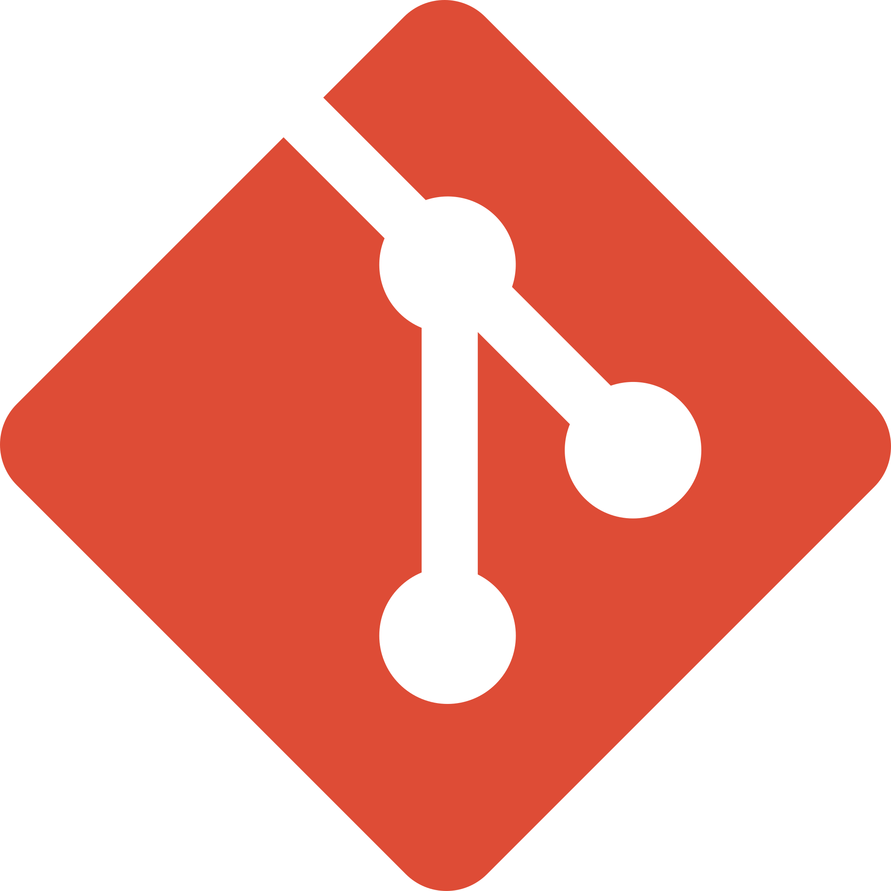

<!--  -->
<!-- May add the top image back again in the future -->
 
<!--<h1 align="center">🚀️ Hi there, I'm Shreyas! </h1> -->

<!--<h3 align="center">🎯️An undergraduate student at BITS Goa and self taught developer 🚀️</h3> -->
  

  

 

## 📖 About me

- 🔭 I’m currently working on **Large Language Models and their applications in various Domains**

- 💼 **AI Research Scientist** at **[MStack AI](https://mstack.ai)**

- 💼 Prev: **Research Fellow @ [Deep forest Sciences](http://deepforestsci.com/), Product Engineering Intern @ [Sprinklr](https://www.sprinklr.com)**

- 🎓 **Computer Science and Chemistry @ BITS Pilani**

- 😄 Pronouns: **He/Him**

- 💬 Ask me anything about **Technology in general and Formula1**

<!-- -   ⚡ Fun fact  -->

## 📫 Connect with me

  
	
	
	

  
## 💻 Technologies and Tools

 
	<code>  </code>
	<code>  </code>
	<code>  </code>
	<code>  </code>
	<code>  </code>
	<code>  </code>
	<code>  </code>
 	<code>  </code>
	<code>   </code>
 	<code>  </code>

  
  
## 📈 Github Stats

<!-- https://github.com/anuraghazra/github-readme-stats -->

  
📊 GitHub Profile Stats

   
  

 
  
💻 Most used languages

   
  
   
  <b>Note:</b> This chart is only a metric of which languages my public code on GitHub consists of and does not reflect my experience or skill level.

  
⚡GitHub Streak

   
  

 

<!--
&nbsp;
-->

<!-- 

 -->

<!-- 

 -->

<!--
**shreyasvinaya/shreyasvinaya** is a ✨ _special_ ✨ repository because its `README.md` (this file) appears on your GitHub profile.

Here are some ideas to get you started:

- 🔭 I’m currently working on ...
- 🌱 I’m currently learning ...
- 👯 I’m looking to collaborate on ...
- 🤔 I’m looking for help with ...
- 💬 Ask me about ...
- 📫 How to reach me: ...
- 😄 Pronouns: ...
- ⚡ Fun fact: ...
-->
